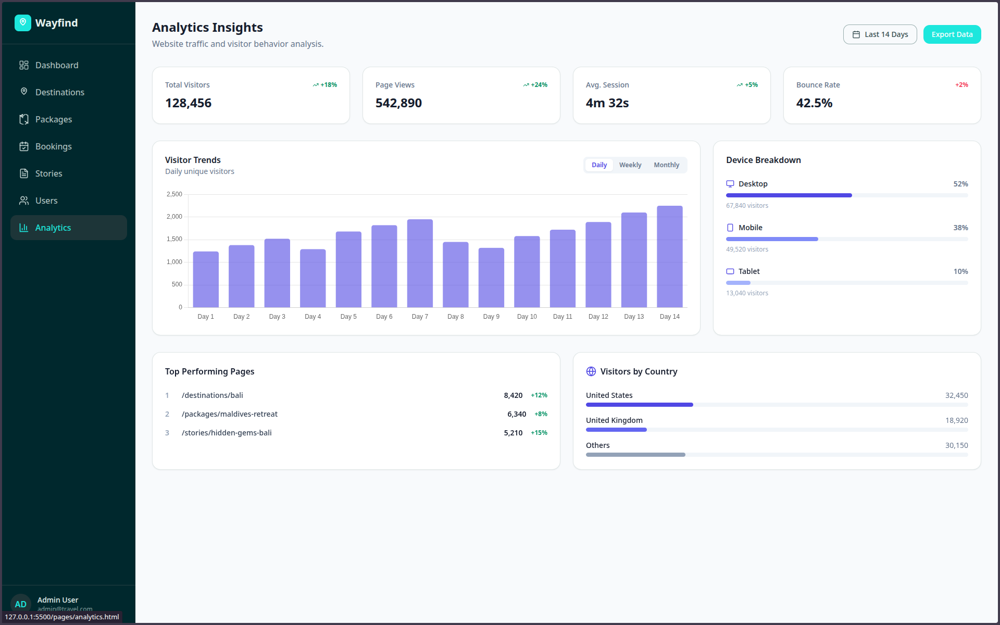
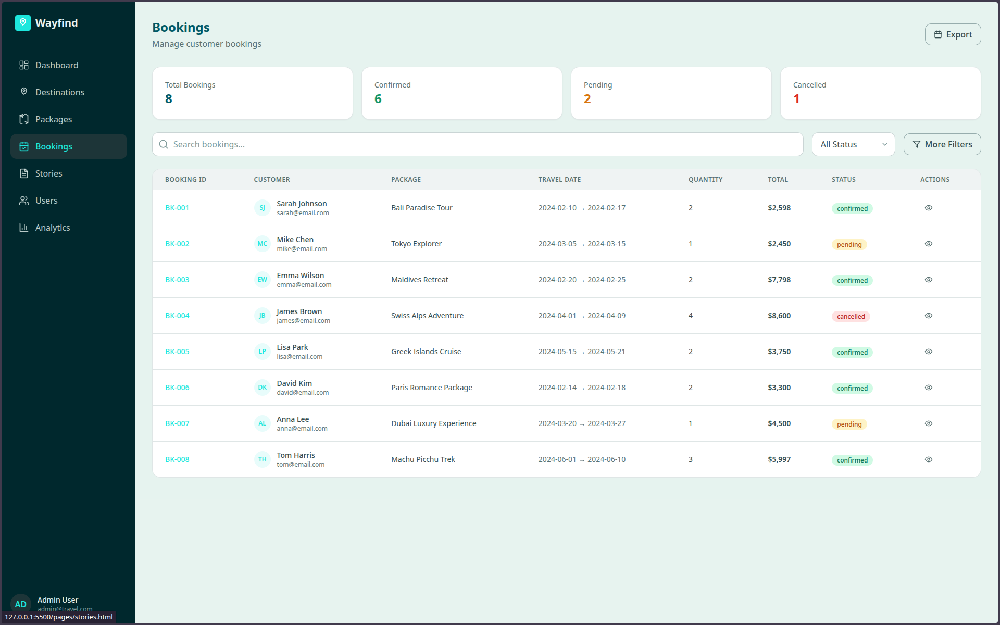
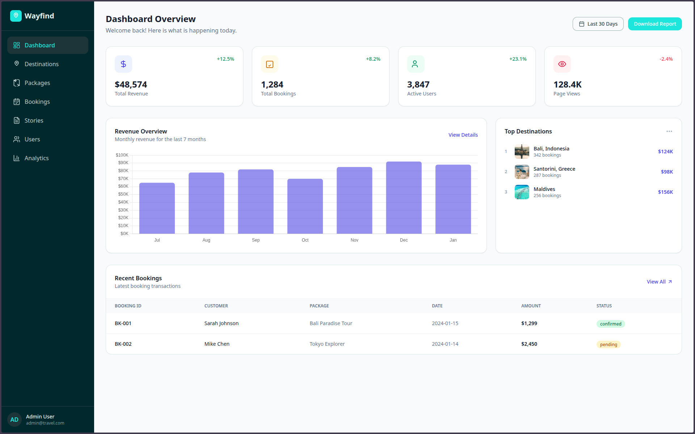
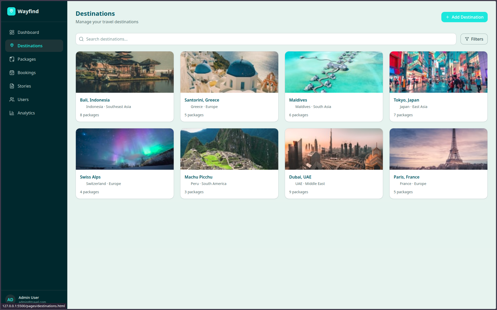
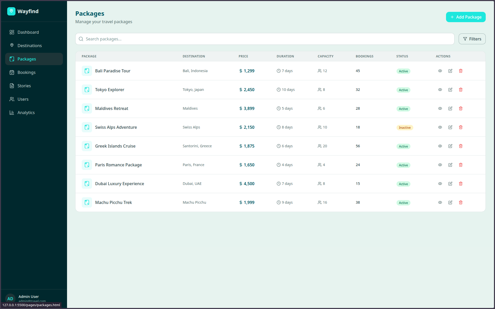
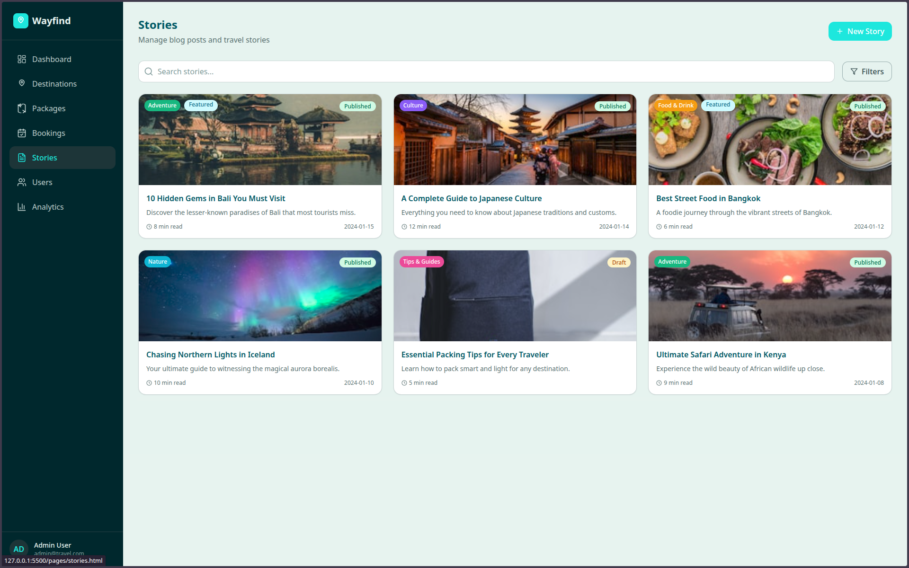
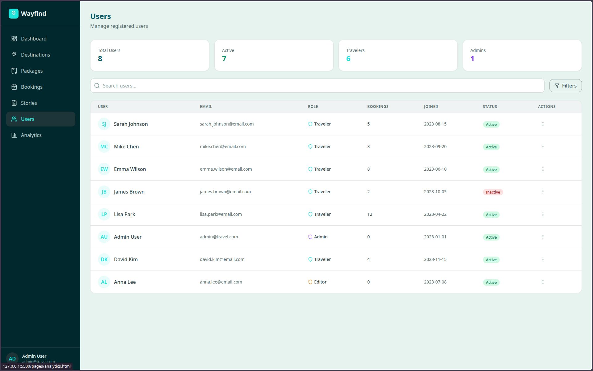

# Wayfind

## About

Modern dashboard template for travel management

## Usage

1. Clone the repository
2. Navigate to the `pages` directory
3. Open the `.html` files in your browser to view the different dashboard pages.

## Preview

| Page        | Preview                                |
| ----------- | -------------------------------------- |
| Analytics   |      |
| Bookings    |        |
| Dashboard   |      |
| Destination |  |
| Packages    |        |
| Stories     |          |
| Users       |              |
